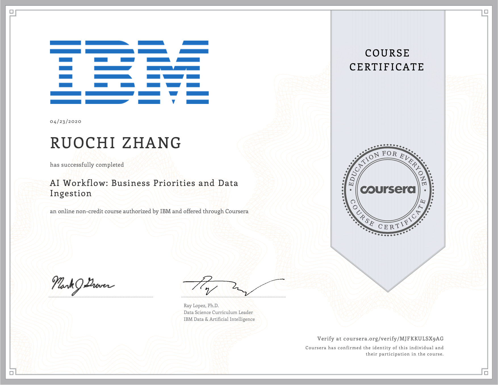

# IBM-AI-Enterprise-Workflow-Specialization

This is the coursera course [IBM AI Enterprise Workflow Specialization](https://www.coursera.org/specializations/ibm-ai-workflow) lectured by IBM 

## About this Specialization 

This six course specialization is designed to prepare you to take the certification examination for IBM AI Enterprise Workflow V1 Data Science Specialist. IBM AI Enterprise Workflow is a comprehensive, end-to-end process that enables data scientists to build AI solutions, starting with business priorities and working through to taking AI into production. The learning aims to elevate the skills of practicing data scientists by explicitly connecting business priorities to technical implementations, connecting machine learning to specialized AI use cases such as visual recognition and NLP, and connecting Python to IBM Cloud technologies. The videos, readings, and case studies in these courses are designed to guide you through your work as a data scientist at a hypothetical streaming media company.

Throughout this specialization, the focus will be on the practice of data science in large, modern enterprises. You will be guided through the use of enterprise-class tools on the IBM Cloud, tools that you will use to create, deploy and test machine learning models. Your favorite open source tools, such a Jupyter notebooks and Python libraries will be used extensively for data preparation and building models. Models will be deployed on the IBM Cloud using IBM Watson tooling that works seamlessly with open source tools. After successfully completing this specialization, you will be ready to take the official IBM certification examination for the IBM AI Enterprise Workflow.

## AI Workflow: Business Priorities and Data Ingestion

### About this Course

This is the first course of a six part specialization.  You are STRONGLY encouraged to complete these courses in order as they are not individual independent courses, but part of a workflow where each course builds on the previous ones.

This first course in the IBM AI Enterprise Workflow Certification specialization introduces you to the scope of the specialization and prerequisites.  Specifically, the courses in this specialization are meant for practicing data scientists who are knowledgeable about probability, statistics, linear algebra, and Python tooling for data science and machine learning.  A hypothetical streaming media company will be introduced as your new client.  You will be introduced to the concept of design thinking, IBMs framework for organizing large enterprise AI projects.  You will also be introduced to the basics of scientific thinking, because the quality that distinguishes a seasoned data scientist from a beginner is creative, scientific thinking.  Finally you will start your work for the hypothetical media company by understanding the data they have, and by building a data ingestion pipeline using Python and Jupyter notebooks.

By the end of this course you should be able to:
1.  Know the advantages of carrying out data science using a structured process
2.  Describe how the stages of design thinking correspond to the AI enterprise workflow
3.  Discuss several strategies used to prioritize business opportunities
4.  Explain where data science and data engineering have the most overlap in the AI workflow
5.  Explain the purpose of testing in data ingestion 
6.  Describe the use case for sparse matrices as a target destination for data ingestion 
7.  Know the initial steps that can be taken towards automation of data ingestion pipelines
 
Who should take this course?
This course targets existing data science practitioners that have expertise building machine learning models, who want to deepen their skills on building and deploying AI in large enterprises. If you are an aspiring Data Scientist, this course is NOT for you as you need real world expertise to benefit from the content of these courses.
 
What skills should you have?
It is assumed you have a solid understanding of the following topics prior to starting this course: Fundamental understanding of Linear Algebra; Understand sampling, probability theory, and probability distributions; Knowledge of descriptive and inferential statistical concepts; General understanding of machine learning techniques and best practices; Practiced understanding of Python and the packages commonly used in data science: NumPy, Pandas, matplotlib, scikit-learn; Familiarity with IBM Watson Studio; Familiarity with the design thinking process.

### Week1

- [Materials](./course1/week1/materials)
- [Project](./course1/week1/project)
- [Quiz](./course1/week1/quiz)
- [Note](./course1/week1/notes)

### Week2

- [Materials](./course1/week2/materials)
- [Project](./course1/week2/project)
- [Quiz](./course1/week2/quiz)
- [Note](./course1/week2/notes)

